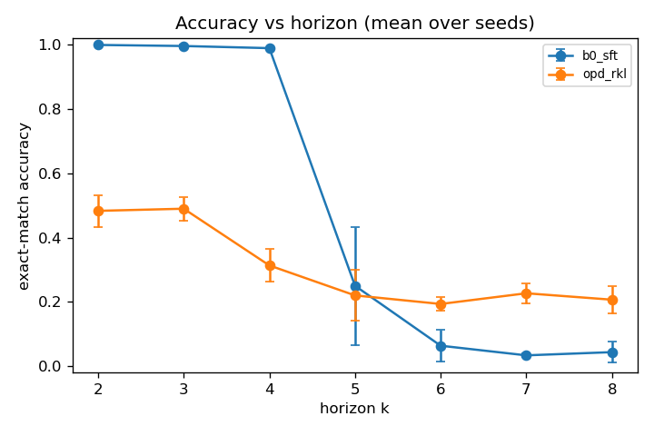

# kd-lab — on-policy distillation

On-policy distillation added to kd-lab, with a controlled study that isolates the exposure-bias
mechanism on a horizon-controllable task.

## Contribution (stated honestly)

The method is **not novel**: it is GKD (Agarwal et al., 2023, [arXiv:2306.13649](https://arxiv.org/abs/2306.13649)),
popularized by Thinking Machines (Lu, 2025). This project contributes:

1. a clean, tested implementation of the full **divergence x data-source** design space (forward
   KL, reverse KL, generalized JSD(beta)) x (off-policy teacher data, on-policy student rollouts,
   mixed by fraction lambda) inside kd-lab;
2. a controlled experiment isolating the **exposure-bias mechanism** via a horizon-stratified
   analysis that connects LM distillation to imitation learning (DAgger, Ross et al., 2011); and
3. an honest characterization of where each method wins and fails.

## Headline result

Student Qwen2.5-0.5B-Instruct distilled from a frozen Qwen2.5-1.5B-Instruct on **pointer-chase**
(read a permutation table, chase k pointers). Trained on horizons k in {2,3,4}; evaluated on
k in {2..8}, so **k>=5 is extrapolation**. Greedy exact-match, mean over 3 seeds.



Off-policy SFT is near-perfect in-distribution (k<=4) then **collapses** on extrapolation
(k=8: 0.04). On-policy reverse-KL distillation is weaker in-distribution but degrades far more
gently and **dominates on extrapolation** (k=8: 0.21). The curves cross near k=5: off-policy wins
where it has gold supervision, on-policy wins where the student must handle states beyond the
training horizon. The positional teacher-student KL probe shows why: the off-policy student's KL to
the teacher on its own rollouts is large and erratic, while the on-policy student's stays uniformly
low, because it trained on its own state distribution.

Full numbers, per-hypothesis verdicts (H1 confirmed; H2 accuracy confirmed / diversity untested;
H3 partial; H4 descoped), and honest caveats are in [EXPERIMENTS.md](EXPERIMENTS.md). Figures in
[results/figures/](results/figures/), the table in
[results/analysis/results_table.csv](results/analysis/results_table.csv). Every number comes from a
logged run with a config hash; nothing is hand-edited.

## Reproduce

Floor (no GPU, runs anywhere):
```bash
pip install -e ".[dev]"
pytest -q                 # divergences (TRL-parity), task, metrics, sampler, runner, aggregator
python -m kd_lab.experiments.run --config configs/opd_rkl_smoke.yaml --dry-run
```

Full study (single A100/V100, from the repo root on the cluster):
```bash
pip install -e ".[dev,experiments]"
python -m kd_lab.experiments.sweep --base configs/pointer_chase_base.yaml --out configs/generated
sbatch kd_lab/experiments/slurm_sweep.sh configs/generated     # 36 runs; ~1.5 GPU-hr each
python -m kd_lab.experiments.aggregate --results results --out results/analysis
```
A single condition: `sbatch kd_lab/experiments/run_one.sbatch configs/calib_opd_rkl.yaml`.

## What is reproduction vs new
- **Reproduction:** on-policy distillation itself (GKD), the reverse-KL per-token objective, the
  divergence family. The hand-rolled losses match TRL's `GKDTrainer` exactly
  ([tests/test_trl_oracle.py](tests/test_trl_oracle.py)).
- **New here:** the horizon-stratified mechanism study (the crossover + the positional-KL probe),
  the swappable divergence x data-source implementation, and the failure-mode reporting.

## Layout
```
kd_lab/distillation/   divergences.py, on_policy.py, supervised.py (B0/B1), sampling.py
kd_lab/tasks/          pointer_chase.py (horizon-controllable), gsm8k.py (external validity, wired)
kd_lab/evaluation/     metrics.py, positional_kl.py (mechanism probe)
kd_lab/experiments/    run.py, sweep.py, aggregate.py, slurm_sweep.sh, run_one.sbatch
configs/               smoke, calibration, full base config
results/               per-run metrics.json, analysis/ (table + figures)
writeup/               medium article, linkedin post
```

## Citations
Hinton et al. 2015 ([1503.02531](https://arxiv.org/abs/1503.02531)); Kim & Rush 2016
([1606.07947](https://arxiv.org/abs/1606.07947)); Ross et al. 2011 (DAgger); Agarwal et al. 2023,
GKD ([2306.13649](https://arxiv.org/abs/2306.13649)); Gu et al. 2023, MiniLLM
([2306.08543](https://arxiv.org/abs/2306.08543)); Lu & Thinking Machines Lab, 2025.
