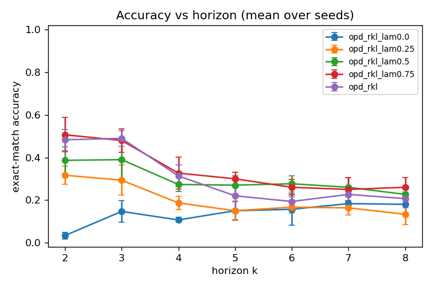
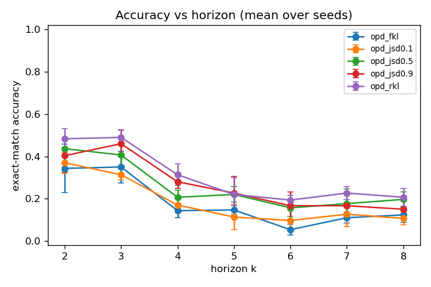

# Why training a student on its own mistakes fixes exposure bias: a controlled study

Knowledge distillation usually trains a small student on a big teacher's outputs over a fixed
corpus. That is off-policy: the student only ever sees states the teacher visits. At inference the
student conditions on its own previous tokens, drifts into states it never trained on, and errors
compound along the sequence. This is exposure bias, and it is the same pathology that DAgger (Ross,
Gordon, Bagnell, 2011) was invented to fix in imitation learning: train the learner on the
learner's own state distribution, with expert supervision, so it learns to recover from its own
mistakes.

On-policy distillation is the language-model version of that fix. The student generates its own
rollouts; a frozen teacher scores every token of those rollouts with its full next-token
distribution; the student is updated to match the teacher on the states it actually visits. The
method is not new. It is GKD (Agarwal et al., 2023, arXiv:2306.13649), recently popularized by
Thinking Machines (Lu, 2025). What I did is reproduce it inside my distillation library and run a
controlled experiment that isolates *why* it helps, by measuring how the off-policy-versus-on-policy
gap changes with generation horizon. This post reports what I found, including the parts that did
not match the textbook story.

## What on-policy distillation actually optimizes

Let the student generate a response `y = (y_1, ..., y_L)` for a prompt `x`. The rollout is treated
as fixed data: no gradient flows through sampling. Score it with both models by a forward pass over
`[x; y]`. At each response position `t`, the student has a next-token distribution
`p_S(. | x, y_<t)` (gradients flow here) and the frozen teacher has `p_T(. | x, y_<t)` (detached).
The primary objective is the per-token reverse KL, averaged over response positions:

```
D_RKL(t) = sum_v p_S(v | x, y_<t) * [ log p_S(v | x, y_<t) - log p_T(v | x, y_<t) ]
         = KL( p_S || p_T )
```

Two things matter here. First, this is reverse KL (student first), which is mode-seeking: it
pushes the student to put its mass where the teacher is confident, rather than covering all of the
teacher's mass (MiniLLM, Gu et al., 2023, arXiv:2306.08543). Second, and more importantly, the
update is **supervised learning on self-generated data**. There is no policy-gradient term and no
REINFORCE variance, because the rollout is fixed once sampled and the teacher supplies a dense
per-token target. That is why on-policy distillation is cheap and stable relative to RL: it keeps
the on-policy state distribution but replaces the sparse scalar reward with a dense distributional
one.

I implemented the divergence as a swappable axis (forward KL, reverse KL, generalized JSD(beta))
crossed with the data source (off-policy teacher data, on-policy student rollouts, or a mix by a
fraction lambda). To make sure the hand-rolled losses were correct, I checked them against TRL's
`GKDTrainer`: forward and reverse KL match to floating-point zero, and the generalized JSD matches
for interior beta to about 1e-8. (TRL special-cases the JSD endpoints to the raw KLs; my
implementation returns the true JSD, which is 0 at beta in {0,1}. That is a convention difference,
not a bug, and the test pins it so nobody "fixes" it later.)

## The task: a horizon dial

To isolate exposure bias you want a task whose difficulty is controlled almost entirely by one
knob: the generation horizon. I used pointer-chase. Each example gives a random permutation over N
nodes as an in-context table, a start node, and a hop count k; the answer is the start followed k
times through the table. Horizon = k is a single dial. A wrong hop sends the chain to a wrong node
and every downstream hop is then wrong, so errors compound exactly the way exposure bias predicts.
It is exact-match scorable, and the labels are arbitrary so there is no shortcut around reading the
specific table.

I trained on horizons k in {2, 3, 4} and evaluated on k in {2..8}. So **k >= 5 is extrapolation
beyond the training horizon**, which is where a model that only memorized in-distribution
trajectories should fall apart. Student is Qwen2.5-0.5B-Instruct, teacher is a frozen
Qwen2.5-1.5B-Instruct, same tokenizer family. Three seeds per condition, greedy exact-match as the
pre-registered primary metric.

One practical note that turned out to matter a lot: these are Instruct models, and they only work
if you apply the chat template. Feeding raw prompts put the teacher at ~5% (floor). With the chat
template the teacher reaches ~30% on pointer-chase, well above the ~6% base student. That gap is
what makes the study meaningful; without a capable teacher there is nothing to distill.

## The headline result: a crossover


Off-policy SFT (train on gold solutions) is near-perfect in-distribution: 1.00, 1.00, 0.99 at
k = 2, 3, 4. Then it collapses on extrapolation: 0.25, 0.06, 0.03, 0.04 at k = 5, 6, 7, 8.
Sequence-level KD (Kim & Rush, 2016, arXiv:1606.07947), which is SFT on the teacher's own
generations, gives the identical curve.

On-policy reverse-KL distillation is worse in-distribution (0.48 at k=2) but degrades far more
gently and dominates on extrapolation: 0.22, 0.19, 0.23, 0.21 at k = 5, 6, 7, 8. At k=8 that is a
roughly 5x gap in favor of on-policy (0.21 vs 0.04).

So the off-policy-versus-on-policy gap is not a single number. It depends on horizon and it flips
sign. Off-policy wins where it has gold supervision (the training horizons). On-policy wins where
the student has to handle states beyond the training horizon, because it practiced its own
trajectories there. That crossover is exactly the exposure-bias story, and it is more honest than
"on-policy is better": on this task on-policy is the worse choice if you only care about the
horizons you trained on.

## Why: the positional-KL probe

The mechanism claim is that the off-policy student drifts into states the teacher would not have
led it to. You can measure that directly. Take each trained student, let it generate its own
rollouts, and compute the per-token KL between the student and the teacher as a function of position
in the response.

The off-policy SFT student's KL to the teacher on its own rollouts is large and erratic: about 4.75
at the first generated token, then bouncing between 0.5 and 1.6. The on-policy student's KL stays
uniformly low and flat, roughly 0.0 to 0.17 across positions. The on-policy student trained on its
own state distribution, so when it generates, it stays in agreement with the teacher. The
off-policy student, generating states it never saw in training, disagrees with the teacher and the
disagreement does not settle down. That is exposure bias, visible per token.

## The data-source knob: how much on-policy do you need?



Mixing off-policy and on-policy data by a fraction lambda (0 = fully off-policy, 1 = fully
on-policy) shows the gains arrive fast and then saturate. At k=2 the accuracy goes 0.03, 0.32,
0.39, 0.51, 0.48 for lambda = 0, 0.25, 0.5, 0.75, 1.0. Most of the benefit is already there by
lambda = 0.5.

But it is not strictly monotonic to fully on-policy, which is the part that did not match my
pre-registered hypothesis. On the extrapolation tail, mixed lambda = 0.5 to 0.75 matches or beats
pure on-policy: at k=6, lambda=0.5 gives 0.28 versus 0.19 for lambda=1.0. The honest version of H3
is "more on-policy helps with diminishing returns, mostly saturated around lambda 0.5 to 0.75,"
not "monotonic all the way to 1.0." A little teacher-distribution data mixed in seems to help
stability without costing much.

## The divergence knob, and a failure mode I did not fully test



For on-policy training, reverse KL beats generalized JSD beats forward KL on exact match. Forward
KL on-policy is surprisingly weak: it collapses on the tail much like the off-policy baselines
(k=6: 0.05). Forward KL is mass-covering, so it asks the student to spread probability the way the
teacher does, including the teacher's uncertainty, which does not sharpen into confident correct
answers here. Reverse KL is mode-seeking and does sharpen. Generalized JSD sits in between, best
around beta = 0.5 to 0.9.

The documented reverse-KL failure mode is diversity collapse: mode-seeking should raise pass@1 but
lower pass@k, token entropy, and distinct-n (MiniLLM, Gu et al., 2023). I did **not** test that
claim. This sweep ran greedy evaluation only, to keep the compute budget in check. The pass@k,
entropy, and distinct-n metrics are implemented and unit-tested, but the sampled-eval runs that
would exercise them were descoped. So I can report that reverse KL wins on greedy accuracy; I
cannot yet report what it costs in diversity. That is an open item, not a settled result.

The same discipline applies to off-policy logit KD (Hinton, 2015, arXiv:1503.02531). Its loss fell
(0.57 to 0.13), so it trained, but its accuracy stayed near the floor (~0.1). Soft-label KL from a
teacher that is only ~30% accurate does not produce sharp correct answers, whereas hard-label SFT
does. I did not tune it further (temperature 1, learning rate 1e-5), so I report it as observed
rather than as a claim about logit KD in general.

## The connection to closed-loop planning

Compounding error over a horizon is not a language-model-specific problem. It is the central
concern in closed-loop planning, which is what my other project (av-policy-lab) studies: a policy
that looks fine on logged, in-distribution states can fail in interaction-critical, long-horizon
scenarios once its own actions move the world into states the training distribution did not cover.
The fix is structurally the same as DAgger and as on-policy distillation: put the learner in its
own state distribution during training and supervise it there. Seeing the identical crossover show
up in a tiny LM distillation task and in autonomous-driving planning is the reason this branch
exists. The mechanism is portable even when the domains are not.

## Honest limitations

This is one synthetic task, one model pair, 400 training steps, greedy evaluation, three seeds.
GSM8K is wired in for external validity but was not run in this sweep. The reverse-KL
diversity-collapse claim (H2) is untested. The efficiency comparison (H4: accuracy per GPU-hour,
and a GRPO baseline) was descoped. The pointer-chase result is clean precisely because the task is
synthetic and horizon-controllable; whether the same crossover holds on real chain-of-thought math
is the obvious next experiment, and the harness is ready to run it.

## What is reproduction and what is new

Reproduction: on-policy distillation (GKD), the reverse-KL per-token objective, the divergence
family. The losses match TRL's `GKDTrainer` exactly. New here: the horizon-stratified mechanism
study (the crossover and the positional-KL probe), the swappable divergence-by-data-source
implementation, and the honest failure-mode reporting. The full code, the 36-run results with
config hashes, and every figure in this post are in the repo. If a number here is not in the
repo's `results/`, it does not exist.

Repo: https://github.com/parvpatodia/kd-lab

References: Hinton, Vinyals, Dean 2015 (arXiv:1503.02531); Kim & Rush 2016 (arXiv:1606.07947);
Ross, Gordon, Bagnell 2011 (DAgger); Agarwal et al. 2023, GKD (arXiv:2306.13649); Gu et al. 2023,
MiniLLM (arXiv:2306.08543); Lu and Thinking Machines Lab 2025.
